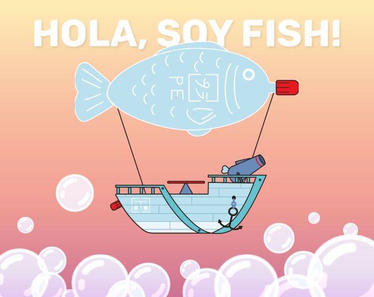

# HOLA, SOY FISH

Come aboard the soy bubble boat and fight through an ocean full of dangers. You'll share the controls of the boat as a team. Work together to steer your boat and defeat opponents. But watch out! If your soy fish runs out of air, you will meet your doom at the bottom of the ocean.

[Play Now](https://thejp.itch.io/hola-soy-fish)

## Controls - X-Box Controller (Recommended)

| Player 1      |                | Player 2      |                    |
|--------------:|----------------|--------------:|--------------------|
|    Left Stick | Fly Left/Right |    Left Stick | Move Cannon Target |
|           `A` | Fly Up         |           `A` | Fly Up             |
| Right Trigger | Reload Cannon  | Right Trigger | Fire Cannon        |
|           `Y` | Fly Down       |               |                    |

## Controls - Keyboard

| Player 1                    |                | Player 2                    |                    |
|----------------------------:|----------------|----------------------------:|--------------------|
|             `WASD` / `IJKL` | Fly Left/Right |             `WASD` / `IJKL` | Move Cannon Target |
|                         `E` | Fly Up         |                         `O` | Fly Up             |
| `F` / `;` (key next to `L`) | Reload Cannon  | `F` / `;` (key next to `L`) | Fire Cannon        |
|                   `Q` / `U` | Fly Down       |                             |                    |
